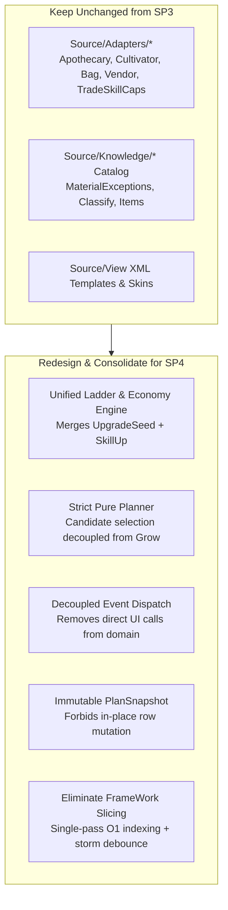

# StockPiler: Refactoring Strategy & StockPiler4 Roadmap

This document outlines the strategic decision analysis on whether to apply targeted bug fixes to **StockPiler4** or develop a refactored **StockPiler4**, along with the recommended architectural blueprint.

---

## 1. Strategic Decision: Target Fixes vs. StockPiler4

### 1.1 Why Targeted Fixes on StockPiler4 Alone Are a Trap
Applying localized bug fixes (e.g., fixing `pairs` table deletion in [`RefinePipelineStore.lua`](file:///c:/Games/Return%20of%20Reckoning/Interface/AddOns/StockPiler4/Source/Stores/RefinePipelineStore.lua#L151), deduplicating `ToNarrow`/`NowSec`, or clearing memory churn in `RebuildFromBags`) leaves the root causes untouched:

1. **The Whack-A-Mole Regression Loop:** 
   The commit history across minor versions (0.3.147 through 0.3.220) demonstrates constant bug recurrence (stalled plant ticks, stuck upgrading seeds, phantom buys, frame spikes). These were not isolated oversights; they are direct consequences of **mutable snapshot corruption** (domain code modifying `PlanSnapshot.Get().rows` in-place) and **tight private-member coupling** (`_refineDirty`, `_plantQueueDirty`, `_closedLiveSnapGen`).
2. **Entangled Monoliths:** 
   [`SkillUp.lua`](file:///c:/Games/Return%20of%20Reckoning/Interface/AddOns/StockPiler4/Source/SkillUp.lua) (3,872 lines) and [`UpgradeSeed.lua`](file:///c:/Games/Return%20of%20Reckoning/Interface/AddOns/StockPiler4/Source/UpgradeSeed.lua) (2,287 lines) represent over 6,000 lines of parallel ladder and deficit calculations. Any modification to one risks desyncing the other.
3. **Fragile Suppression Webs:** 
   [`Scheduler.lua`](file:///c:/Games/Return%20of%20Reckoning/Interface/AddOns/StockPiler4/Source/Core/Scheduler.lua) has accrued over 15 interlocking suppression flags and timers because the core loop cannot reliably determine whether internal state is clean.

### 1.2 Why a Blank-Slate Rewrite Is Also Dangerous
Historically, StockPiler2 was built to escape StockPiler1's UI coupling, and StockPiler4 was built to escape StockPiler2's patch layers. Yet by version 0.3.220, StockPiler4 accumulated the exact same complexity because new features were added without maintaining architectural boundaries.

A complete rewrite from zero is dangerous because **several layers in StockPiler4 are mature and battle-tested against Warhammer Online client quirks**:
- **[`Source/Adapters/`](file:///c:/Games/Return%20of%20Reckoning/Interface/AddOns/StockPiler4/Source/Adapters/):** Wrappers for Apothecary, Cultivator, Backpack soft-locks, and TradeSkills handle subtle client bugs (e.g., `INVALID(0)` stability desyncs, missing item bonuses, soft lock releases) that took hundreds of hours to diagnose.
- **[`Source/Knowledge/`](file:///c:/Games/Return%20of%20Reckoning/Interface/AddOns/StockPiler4/Source/Knowledge/):** Exception tables ([`MaterialExceptions.lua`](file:///c:/Games/Return%20of%20Reckoning/Interface/AddOns/StockPiler4/Source/Knowledge/MaterialExceptions.lua)), hybrid item classification ([`Classify.lua`](file:///c:/Games/Return%20of%20Reckoning/Interface/AddOns/StockPiler4/Source/Knowledge/Classify.lua)), and item specs are high-value domain assets.
- **View XML Layouts & Skins:** Window definitions, lists, and templates are already tuned to RoR's frame manager.

---

## 2. Recommendation: The "Clean-Core" StockPiler4

Develop **StockPiler4** as a parallel-safe sibling addon (separate directory `Interface/AddOns/StockPiler4/`, distinct saved variables, slash command `/sp4`), preserving the working StockPiler4 installation for active gameplay while executing a targeted core redesign.



---

## 3. Core Architectural Pillars for StockPiler4

### 3.1 Unify Seed Ladder & Skill Progression
- **Problem in SP3:** [`UpgradeSeed.lua`](file:///c:/Games/Return%20of%20Reckoning/Interface/AddOns/StockPiler4/Source/UpgradeSeed.lua) and [`SkillUp.lua`](file:///c:/Games/Return%20of%20Reckoning/Interface/AddOns/StockPiler4/Source/SkillUp.lua) contain duplicate implementations of ladder navigation, genus rung merging, seed deficit math, and surplus reservation.
- **SP4 Design:**
  - Create a single `Knowledge/GenusLadder.lua` to manage plant family ladders, rungs, and genus merges.
  - Create `Planner/ClimbPlan.lua` to calculate deficits: whether skilling up or upgrading a watch seed, the question is identical: *"Given target tier T and current skill S, what is the best owned seed to plant, what should be refined, and what should be bought?"*
  - This collapses ~6,000 lines of entangled code into < 1,500 lines.

### 3.2 Restore Pure Planning (Decouple Execution from Planning)
- **Problem in SP3:** [`Grow.lua`](file:///c:/Games/Return%20of%20Reckoning/Interface/AddOns/StockPiler4/Source/Grow.lua) contains [`PickPlantCandidate`](file:///c:/Games/Return%20of%20Reckoning/Interface/AddOns/StockPiler4/Source/Grow.lua#L1523), waterfill bottle gap calculations, and demand sorting.
- **SP4 Design:**
  - The [`Planner`](file:///c:/Games/Return%20of%20Reckoning/Interface/AddOns/StockPiler4/Source/Planner/Planner.lua) outputs actionable intent structures:
    ```lua
    Plan.nextPlantAction = {
        seedUid = 1234,
        plotNum = 1,
        reason = "watch_deficit" -- or "climb" / "skillup"
    }
    ```
  - [`Grow.lua`](file:///c:/Games/Return%20of%20Reckoning/Interface/AddOns/StockPiler4/Source/Grow.lua) becomes a pure executor: check if plot is empty, call `CultivatorAdapter.PlantSeed(seedUid, plotNum)`, and track pending state.

### 3.3 Strict Snapshot Immutability
- **Problem in SP3:** [`Brew.lua`](file:///c:/Games/Return%20of%20Reckoning/Interface/AddOns/StockPiler4/Source/Brew.lua) and [`Buy.lua`](file:///c:/Games/Return%20of%20Reckoning/Interface/AddOns/StockPiler4/Source/Buy.lua) fetch `PlanSnapshot.Get().rows` and alter them in-place with live bag counts.
- **SP4 Design:**
  - `PlanSnapshot` is treated as strictly read-only.
  - Executors only emit domain actions. When bags update via engine events, `InventoryStore` increments `snapGen`, and the Planner re-computes cleanly on the next frame budget.

### 3.4 Decoupled, Throttled UI Updates
- **Problem in SP3:** Domain modules, adapters, and the event bridge make direct calls to `StockPiler4Window.RequestFooterRefresh()` and `Ui.MarkWatchUiDirty()`.
- **SP4 Design:**
  - Domain executors publish high-level events: `Events.PLAN_UPDATED`, `Events.GARDEN_UPDATED`.
  - The UI layer subscribes to these events and manages its own redraw throttling (using `OnUpdate` or coalesced timer). Domain code never knows about window handles or XML controls.

### 3.5 Eliminate Frame Slicing in Favor of O(1) Indexing & Storm Debouncing
- **Problem in SP3:** [`FrameWork.lua`](file:///c:/Games/Return%20of%20Reckoning/Interface/AddOns/StockPiler4/Source/Core/FrameWork.lua) spreads spec warming across 6+ frames. This causes temporal state tearing (data changes mid-slice), freezes Watch UI refreshes for 3–5 seconds under storm while waiting on `FW.IsPrewarmBusy()`, and requires over 15 suppression flags in [`Scheduler.lua`](file:///c:/Games/Return%20of%20Reckoning/Interface/AddOns/StockPiler4/Source/Core/Scheduler.lua).
- **SP4 Design:**
  - **Single-pass bag indexing:** In `InventoryStore.lua`, index bag contents in a single pass into a static lookup table (`Inventory.ByRole[role][tier] = count`). Takes ~0.5ms for 80 bag slots.
  - **O(1) Spec Matching:** Match recipe slots directly against the indexed table instead of iteratively scanning all bag slots. Total plan calculation takes < 1.0ms.
  - **Storm Debounce:** Replace multi-frame slicing with a simple 50ms coalesce debounce timer. When multiple bag events fire in quick succession during a harvest storm, debounce them and run the 1.5ms calculation once.
  - Remove `FrameWork.lua` from the core loop entirely, eliminating the prewarm wait states and suppression timer sprawl.


---

## 4. Decision Comparison

| Evaluation Metric | Target Fixes on StockPiler4 | Clean-Core StockPiler4 (Recommended) |
| :--- | :---: | :---: |
| **Risk to Current Gameplay** | High (in-place breakage during play) | **None** (SP3 remains intact and playable) |
| **Time to Initial Stability** | Fast (~1–2 days) | Moderate (~3–5 days) |
| **Codebase Reduction** | Negligible (< 5%) | **~35%–45% reduction** (~3,500+ duplicate lines eliminated) |
| **Long-Term Maintainability** | Low (fragile FSM and coupling remain) | **High** (clear boundaries, isolated modules) |
| **Frame Hitch Headroom** | Heavily reliant on suppression timers | **High** (true immutable snapshot + pure plan) |

---

## 5. Next Steps

See the step-by-step engineering roadmap in [`docs/IMPLEMENTATION_PLAN.md`](file:///c:/Games/Return%20of%20Reckoning/Interface/AddOns/StockPiler4/docs/IMPLEMENTATION_PLAN.md).

